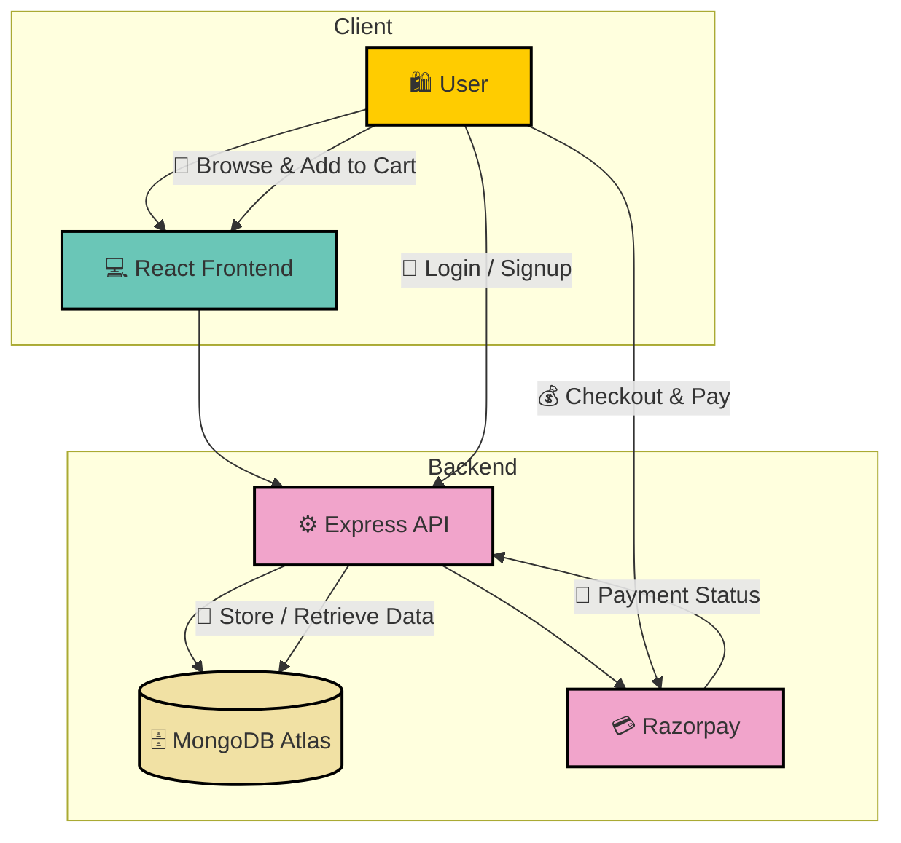

# 🛍️ ShopNest - MERN E-Commerce Platform


---

# 📖 About The Project

**ShopNest** is a modern full-stack **MERN E-Commerce Platform** designed to provide a seamless online shopping experience. Users can browse products, manage carts, place secure orders, and make payments through **Razorpay**. The platform features **JWT Authentication**, **OTP Verification**, and **Cloudinary Image Management**, while administrators can efficiently manage products and orders through a dedicated **Admin Dashboard**. Built with **React, Redux Toolkit, Node.js, Express.js, MongoDB Atlas** for scalability, performance, and security.


---

# ✨ Key Features

* 👤 **User Authentication** – Secure login, registration, and JWT-based authentication.
* 📧 **OTP Verification** – Email OTP verification using Nodemailer.
* 📦 **Product Management** – Browse, search, filter, and view product details.
* 🛒 **Cart & Checkout** – Add to cart, update quantities, and place orders.
* 💳 **Secure Payments** – Integrated Razorpay payment gateway.
* ☁️ **Cloudinary Storage** – Product image upload and management.
* 📍 **Order Tracking** – Track order status and purchase history.
* 👤 **Profile Management** – Update and manage user profile information.
* 🛠️ **Admin Dashboard** – Manage products, orders, and platform activities.
* ⚡ **Fast & Responsive** – Optimized with React, Redux Toolkit.


---

# 📸 Screenshots

## Sign Up Page


## Login Page


## Home Page


## Product Details


## Cart Page


## Checkout Page


## Order Success


## Profile Page


## Admin Dashboard


---

# 🏗️ Architecture

The system architecture is built to ensure **performance, scalability, and modularity**. It follows a **client-server model** with separate frontend and backend responsibilities:

- **Frontend (React + Redux Toolkit):** Handles product browsing, state management, cart operations.
- **Backend (Node.js + Express.js):** Provides REST APIs for authentication, users, products, carts, and orders.
- **Database (MongoDB Atlas + Mongoose):** Stores user accounts, products, orders, OTPs, and transaction records.
- **Authentication (JWT + OTP Verification):** Secure login, registration, email verification, and protected routes.
- **Cloud Storage (Cloudinary):** Manages product image uploads and storage.
- **Payments (Razorpay):** Enables secure online payment processing and order confirmation.



---

# 📂 Directory Structure

```text
Directory structure:
└── umesh590-shopnest-ecom-mern_project/
    ├── package.json
    ├── Backend/
    │   ├── index.js
    │   ├── package.json
    │   ├── seed.js
    │   ├── .env.example
    │   ├── config/
    │   │   ├── cloudinary.js
    │   │   └── db.js
    │   ├── controllers/
    │   │   ├── analyticsController.js
    │   │   ├── authController.js
    │   │   ├── orderController.js
    │   │   ├── paymentController.js
    │   │   └── productController.js
    │   ├── middleware/
    │   │   ├── adminMiddleware.js
    │   │   └── authmiddleware.js
    │   ├── models/
    │   │   ├── Order.js
    │   │   ├── Product.js
    │   │   ├── Review.js
    │   │   └── User.js
    │   ├── routes/
    │   │   ├── analyticsRoutes.js
    │   │   ├── authRoutes.js
    │   │   ├── orderRoutes.js
    │   │   ├── paymentRoutes.js
    │   │   └── productRoutes.js
    │   └── utils/
    │       └── sendEmail.js
    └── Frontend/
        ├── README.md
        ├── eslint.config.js
        ├── index.html
        ├── package.json
        ├── vite.config.js
        └── src/
            ├── App.jsx
            ├── main.jsx
            ├── admin/
            │   ├── AddProduct.jsx
            │   ├── AdminDashboard.jsx
            │   ├── AdminOrders.jsx
            │   ├── AdminProducts.jsx
            │   ├── AdminUsers.jsx
            │   └── EditProduct.jsx
            ├── components/
            │   ├── Footer.jsx
            │   ├── Navbar.jsx
            │   └── ProductCard.jsx
            ├── context/
            │   └── AuthContext.jsx
            ├── pages/
            │   ├── About.jsx
            │   ├── Cart.jsx
            │   ├── Checkout.jsx
            │   ├── Disclaimer.jsx
            │   ├── Home.jsx
            │   ├── Login.jsx
            │   ├── OrderSuccess.jsx
            │   ├── ProductDetail.jsx
            │   ├── Profile.jsx
            │   ├── Register.jsx
            │   ├── ReturnPolicy.jsx
            │   ├── Shop.jsx
            │   └── VerifyOtp.jsx
            ├── redux/
            │   ├── cartSlice.jsx
            │   └── store.jsx
            └── styles/
                ├── auth.css
                ├── cart.css
                ├── global.css
                ├── navbar.css
                └── product.css

```

---

# 🛠️ Built With

- **Frontend:** React.js, Redux Toolkit, React Redux, CSS, Axios, React Router DOM
- **Backend:** Node.js, Express.js
- **Database:** MongoDB Atlas, Mongoose
- **Authentication:** JWT, Bcrypt.js, OTP Verification
- **Email Service:** Nodemailer
- **Cloud Storage:** Cloudinary
- **Payments:** Razorpay
- **Deployment:** Render


---

# ⚙️ Getting Started

## Prerequisites

- Node.js 18+
- MongoDB Atlas
- Cloudinary Account
- Razorpay Account

---

## Installation

Clone repository

```bash
git clone https://github.com/Umesh590/ShopNest-Ecom-MERN_Project.git
```

Frontend

```bash
cd frontend
npm install
npm run dev
```

Backend

```bash
cd backend
npm install
npm run dev
```

---

# 🔑 Environment Variables

Create `.env` inside backend:

```env
PORT=5000
MONGO_URI=mongodb://127.0.0.1:27017/shopnest
JWT_SECRET=your_jwt_secret_key
CLOUDINARY_CLOUD_NAME=your_cloud_name
CLOUDINARY_API_KEY=your_api_key
CLOUDINARY_API_SECRET=your_api_secret
RAZORPAY_KEY_ID=your_razorpay_key_id
RAZORPAY_KEY_SECRET=your_razorpay_key_secret
GMAIL_USER=your_email@gmail.com
GMAIL_PASS=your_email_password
FRONTEND_URL=http://localhost:5173
NODE_ENV=development
```

---

# 🚀 Future Roadmap

- Wishlist Feature
- Product Reviews
- Coupons & Discounts
- Sales Analytics
- Dark Mode
- Multi Vendor Support
- AI Product Recommendations

---

# 👨‍💻 Developer

### Umesh Kumar

💼 Frontend & MERN Stack Developer

GitHub:
https://github.com/Umesh590

LinkedIn:
https://www.linkedin.com/in/umesh-kumar111

---

# ⭐ Show Some Love

If you like this project, give it a ⭐ on GitHub.
